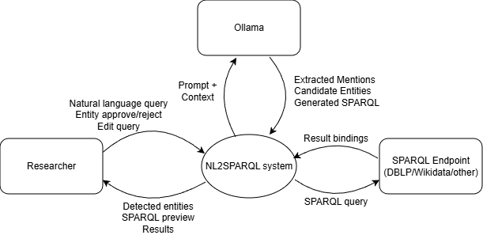
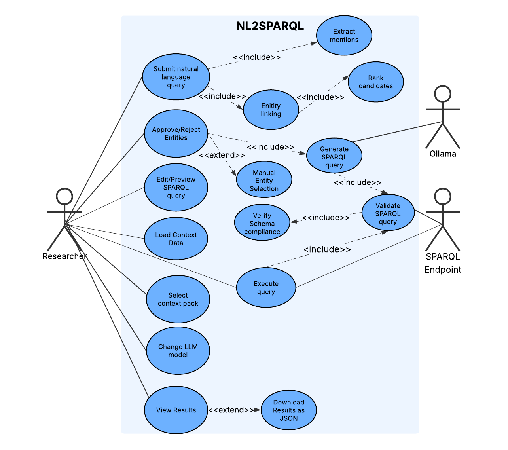
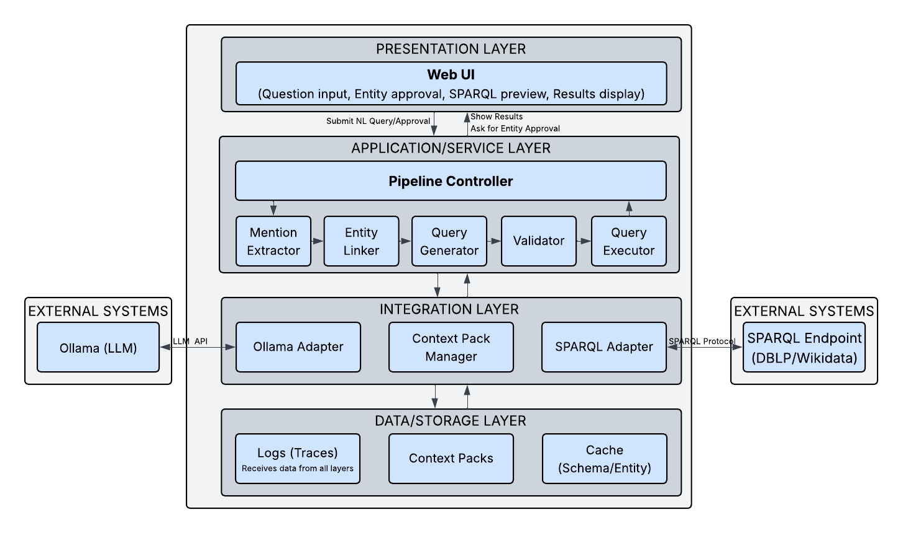
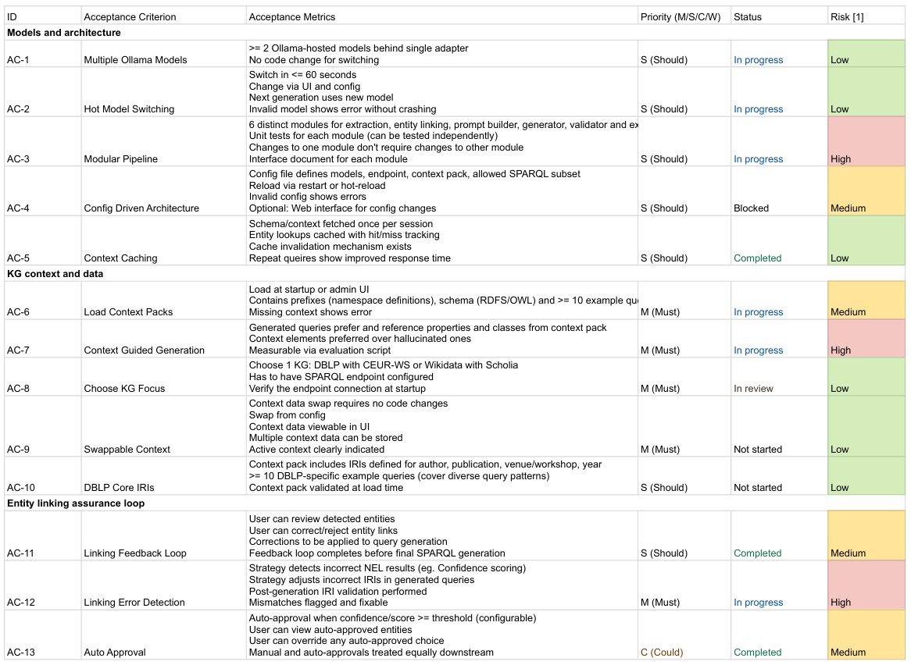
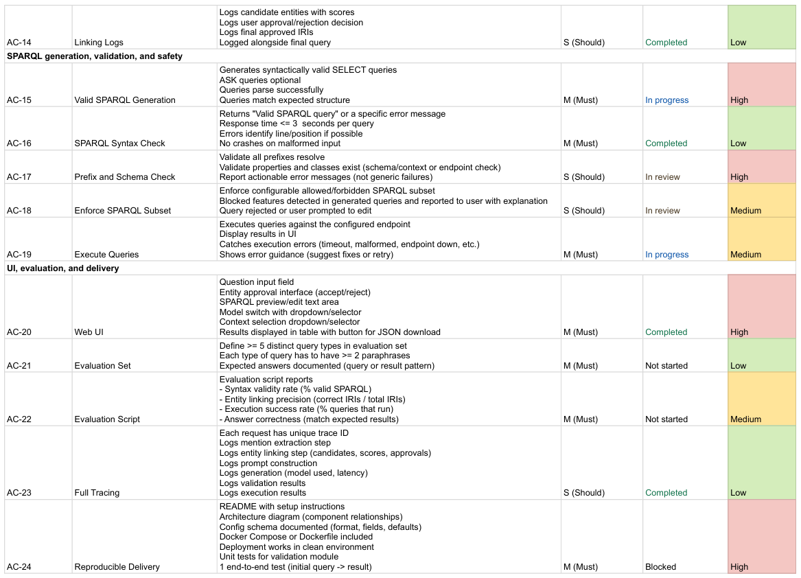
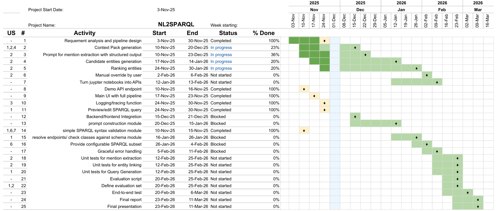

# Requirements Analysis Report

## Problem Statement

Knowledge graphs contain billions of RDF triples and hold valuable information for research, industry, and government. Yet this data remains difficult to access because querying requires SPARQL expertise, knowledge of KG schemas, and precise entity identifiers. As a result, most domain experts cannot use these graphs effectively, and insights remain inaccessible.

LLMs offer a promising abstraction layer, since they can generate structured code such as SPARQL. However, existing systems still hallucinate properties, pick wrong entities, and fail when schemas change.

The core problem is therefore to make knowledge graphs usable without requiring SPARQL expertise while ensuring correctness. This requires a system that combines natural language interfaces, context-aware prompting, interactive entity linking, and strict validation. The goal is a reusable, KG-agnostic pipeline that produces accurate SPARQL queries and lowers the barrier for accessing complex knowledge graphs.

## Glossary

The goal of this is glossary is to provide definitions for key terms and concepts used throughout the project documentation. This will help ensure that all team members and stakeholders have a common understanding of important terminology.

### Terms and Definitions

- **NEL**: Named Entity Linking, the task of identifying and linking named entities in text to their corresponding entries in a knowledge base.
- **Entity linking loop**: Iteratively detecting, proposing, and confirming entity links between a user’s question and the knowledge graph, before generating the final SPARQL query.
- **Knowledge graph**: A structured representation of knowledge that captures entities, their attributes, and the relationships between them. Knowledge is represented as triples, consisting of a subject, predicate, and object.
- **SPARQL**: A query language used to retrieve and manipulate data stored in a knowledge graph or RDF (Resource Description Framework) format.
- **RDFS / OWL**: RDF Schema (RDFS) and Web Ontology Language (OWL) describe the vocabulary and structure of the knowledge graph.
- **ShEx / SHACL**: Shape Expressions (ShEx) and Shapes Constraint Language (SHACL) are used to define and validate the structure and constraints of data in the knowledge graph.
- **IRI**: Internationalized Resource Identifier, a unique identifier used to identify resources in the knowledge graph.
- **Prefixes**: Shortened forms of IRIs used in SPARQL queries to improve readability and reduce verbosity.

### Domain-Specific Knowledge Graphs

- **DBLP**: A computer science bibliography dataset providing structured metadata on research papers, authors, and venues through a public SPARQL endpoint. It offers a clean and predictable schema, making it easy to query and build against, but has limited domain coverage and sparse metadata compared to Wikidata.

- **CEUR-WS**: An open-access collection of workshop proceedings that extends DBLP with more granular information about workshops and sessions. It enriches academic context but introduces additional complexity and less consistent linking quality.

- **Wikidata**: A large, community-maintained knowledge graph covering all domains, including scholarly works. It provides rich metadata, multilingual labels, and stable APIs with integrated search through Elasticsearch. Its scale and openness make it powerful but also harder to link entities reliably and more prone to query timeouts and inconsistent data quality.

- **Scholia**: A service built on top of Wikidata that provides scholarly profiles, timelines, and analytics through pre-built SPARQL queries. It accelerates development by offering ready-to-use patterns but depends entirely on the completeness and quality of Wikidata’s data.

### Comparison of Knowledge Graphs

| Aspect                 | DBLP + CEUR-WS                                                                                       | Wikidata + Scholia                                                                                                                |
|-------------------------|------------------------------------------------------------------------------------------------------|------------------------------------------------------------------------------------------------------------------------------------|
| Schema complexity       | Simple and predictable, easy for LLMs to learn and use.                                              | Rich, fragmented, and harder for LLMs to use without strong prior context.                                                         |
| Entity linking          | Low ambiguity, literal or regex matching usually works.                                             | High ambiguity, requires robust lookup or MWAPI integration.                                                                       |
| Query performance       | Fast and stable for typical queries.                                                                | More prone to timeouts and slower response times for broad queries.                                                                |
| Search capabilities     | Minimal, basic literal or regex search.                                                             | Powerful full-text search through MWAPI.                                                                                           |
| Search robustness       | Brittle for LLM-generated queries, sensitive to small differences in wording or punctuation.         | Robust via MWAPI, tolerant to casing, punctuation, and partial matches, but requires a separate search step.                        |
| Query complexity        | Simple patterns, short queries, low cognitive load for the model.                                   | Complex patterns with multiple properties and qualifiers, more brittle without structured prompting.                               |
| LLM usability           | Easy to prompt for usable queries out of the box, minimal infrastructure needed.                    | Difficult without additional engineering; requires schema context packs, MWAPI integration, and stricter query control.            |
| Development complexity  | Low — fast to implement and get working reliably.                                                  | High — requires careful design, query templating, guardrails, and timeout handling to be reliable.                                 |

## Related work analysis

### Identity Linking

Entity Linking (EL) is a core capability for NL2SPARQL systems, as textual mentions in a user question must be mapped to the correct entities in a knowledge graph. Within the scholarly domain, the DBLP Knowledge Graph presents unique challenges: author names are often ambiguous, publication titles share similar wording, and the KG schema evolves over time. The following summarizes the two major systems developed specifically for DBLP: DBLPLink 1.0 and DBLPLink 2.0.

#### [DBLPLink: An Entity Linker for the DBLP Scholarly Knowledge Graph (DBLPLink 1.0)](https://ceur-ws.org/Vol-3632/ISWC2023_paper_428.pdf)

**Motivation:**
Before its introduction, no dedicated entity linker existed for scholarly KGs such as DBLP. The task requires selecting correct authors, publications, and venues from millions of entities, many of which share identical or near-identical labels.

**Novelty:**
DBLPLink 1.0 proposes a hybrid architecture combining T5-based mention extraction, Elasticsearch candidate retrieval, and a Siamese-network-based reranker that leverages KG embeddings. This was the first end-to-end linker tailored to DBLP.

**Approach:**
The pipeline operates in three stages:

 1. Label and Type Generation
A T5 model is fine-tuned on the DBLP-QuAD dataset to extract entity labels and types directly from natural language questions.
 2. Candidate Generation
Retrieved labels are matched against an Elasticsearch index populated with entity labels. If multiple candidates share the same surface form, disambiguation is required.
 3. Disambiguation via Neural Re-ranking
A Siamese neural network produces a 969-dimensional embedding for both the question and each candidate. This representation includes a BERT embedding, a KG embedding (TransE, ComplEx, or DistMult), and a string similarity feature. The model is trained using a triplet ranking loss, and inference selects the candidate with the lowest cosine distance.
-> KG-embeddings and re-rankers + Elastic Search

**Results:**

Evaluations on the DBLP-QuAD test set show that conditional disambiguation achieves the best performance, with an F1 score just above 0.70. Hard disambiguation performs worse than simple label sorting, indicating that string similarity is a dominant signal for DBLP entities. Larger T5 models do not provide measurable improvements.

**Limitations:**

DBLPLink 1.0 depends on KG embeddings and training data aligned with a specific DBLP schema. After DBLP introduced new entity types in 2024, the model would require full retraining to remain compatible.

#### [DBLPLink 2.0 - An Entity Linker for the DBLP Scholarly Knowledge Graph](https://www.arxiv.org/pdf/2507.22811)

**Motivation:**
Due to changes in the DBLP schema, retraining DBLPLink 1.0 would require recomputing embeddings, retraining the span extractor, and re-training the reranker. Instead, DBLPLink 2.0 adopts a zero-shot approach powered by LLM prompting to avoid these dependencies.

**Novelty:**
DBLPLink 2.0 introduces a new architecture that performs mention extraction, candidate scoring, and reranking entirely through prompt-based LLM methods. The key innovation is scoring candidates by the log-probability of the “yes” token when the LLM is asked whether a given candidate matches the question.

**Approach:**

The pipeline consists of five steps:

 1. Mention Extraction
A prompted LLM outputs a structured JSON list of mentions and types.
 2. Candidate Retrieval
Each mention is matched against a type-specific Elasticsearch index to retrieve candidates.
 3. KG Neighborhood Expansion
For each candidate, up to N one-hop neighbors are retrieved and linearized into short textual triples (e.g., “Author X - authored - Paper Y”).
 4. LLM-based Scoring
The LLM evaluates each triple in the context of the original question and produces a log-probability score for “yes.” Multiple scores per candidate are aggregated, typically via mean pooling.
 5. Reranking
Candidates are sorted by their aggregated scores, and the top candidate is selected.

**Results:**

DBLPLink 2.0 is evaluated on a subset of 100 questions due to the lack of an updated dataset for the new KG schema. The best-performing model, Qwen-3B, achieves an F1 score of 0.44. The system outperforms pure text matching and shows that neighborhood-based scoring provides additional value.

**Limitations:**

The system cannot be directly compared to DBLPLink 1.0 because the underlying KG schemas differ. Performance over the newly introduced Stream entity type remains only partially evaluated. The authors also observe that the mention extractor sometimes generates labels that do not map cleanly to Elasticsearch candidates, limiting recall.

#### Other Entity Linking Approaches

A simple baseline is provided by lightweight systems such as the spaCy entity linker. These systems generate candidates for all span variations, prefer the longest matched span, and select the entity with the highest prior probability. They do not incorporate contextual knowledge and therefore struggle with ambiguous scholarly entities, but they offer efficient baselines. However spaCy linkers are pre-trained and limited to their built-in knowledge bases, making them unlikely to generalize to unseen KGs like DBLP without retraining.

#### Design Implications for Our System

Our system adopts an entity-linking pipeline that generalizes to any knowledge graph without requiring retrained models, pre-built indexes, or KG-specific embeddings. The design draws inspiration from prior work but restructures the pipeline to be fully KG-agnostic and dynamically adaptable.

1. LLM-based Mention Extraction
We extract entity mentions using structured outputs from an LLM. The LLM receives a context pack containing prefixes, class definitions, and example queries, enabling schema-aware extraction across different KGs.

2. Dynamic Context Packs
All KG-specific information is provided through context packs. These packs supply class descriptions, example queries, and constraints, ensuring that the system can switch KGs without code changes or retraining.

3. SPARQL-based Candidate Generation (No Elasticsearch)
Instead of relying on text-search indices, candidates are obtained directly from the KG endpoint using generated SPARQL queries.
If the initial candidate query returns too many results or is not selective enough, the system uses the LLM to refine the SPARQL query based on mention type, attributes, and context.

4. Entity Context via One-Hop Neighbors
For each candidate, the system retrieves one-hop neighbors and converts them into readable triples. This creates lightweight node context similar to DBLPLink 2.0 but generated dynamically for any KG.

5. Re-ranking Using LLM Log-Probabilities
Inspired by DBLPLink 2.0, we will experiment with using the LLM’s log-probabilities (“yes/no” scoring) to evaluate how well a candidate matches the question and its context.
Additional re-rankers (BM25, similarity metrics, attribute matching) may be integrated to complement LLM-based scoring.

Overall Strategy
Our approach builds on the strengths of both earlier systems (structured extraction, contextual disambiguation, scoring) while removing their limitations (dependency on ES indexes, KG-specific embeddings, retraining).
The result is a fully KG-agnostic entity-linking pipeline that adapts dynamically to any graph supported by a SPARQL endpoint.

### SPARQL Query Generation

#### [LLM-based SPARQL Query Generation from Natural Language over Federated Knowledge Graphs](https://arxiv.org/pdf/2410.06062)

**Motivation:**
This work introduces a scalable method enabling accurate SPARQL generation without fine-tuning a llm.

**Novelty:**

- Retrieval-Augmented Generation using example queries, class descriptions, and automatically generated ShEx schemas.
- Automatic creation of endpoint-specific ShEx from VoID metadata—compact and reflective of *actual* endpoint content.
- A SPARQL validator that detects schema violations and feeds corrections back to the LLM.

**Approach:**

1. **Indexing:** Retrieve example Q/A pairs and generate ShEx shapes from VoID; embed and store in a vector database.
2. **Prompting:** Retrieve similar questions and relevant classes to construct a schema-rich prompt.
3. **Validation:** Parse the generated SPARQL, check predicate/class compatibility, and correct errors through an LLM-assisted repair loop.
4. **Transparency:** Interface shows retrieved context and collects user feedback.

**Results:**

- RAG dramatically improves accuracy for all models.
- Full system (RAG + validation) achieves **F1 ≈ 0.91 with GPT-4o**, far exceeding no-RAG baselines.
- Validation especially benefits smaller models by preventing incorrect or empty-result queries.

**Limitations:**

- Occasional hallucination of entity identifiers.
- Reliance on string-matching patterns that may be inefficient in SPARQL engines.
- Quality depends on available endpoint metadata.

#### [Leveraging Data Shapes in Large Language Model Contexts for Question Answering on Public and Private Knowledge Graphs](https://ceur-ws.org/Vol-4094/paper1.pdf)

**Motivation:**
Current LLM-based SPARQL generation methods often fail when models have *not* seen the target graph during pretraining — e.g., in private or less common KGs. This paper asks: can we use explicit schema information (data shapes) to help LLMs generalize to unseen KGs?

**Novelty:**

- Uses KG “data shapes” (e.g. expressed in ShEx or SHACL) as structured schema metadata.
- Augments LLM prompts with these shape constraints to guide SPARQL generation.
- Provides a fully modular pipeline that: extracts entity candidates, generates data shapes, prompts an LLM, then validates the output SPARQL — all automatically.
- Demonstrates improved generalization: on unseen KGs, shape-informed prompting achieved **F1 ≈ 0.28**, compared to baseline **0.00**

**Approach:**

1. **Entity Extraction** — LLM extracts candidate entities from the natural-language question.
2. **Data Shape Generation** — Using a tool (e.g. SheXer), a data shape (ShEx or SHACL) is inferred from the KG around the extracted entities.
3. **Prompt Construction & SPARQL Generation** — The prompt includes the question, extracted entities, and the generated data shape (schema constraints). The selected LLM produces a candidate SPARQL query.
4. **Validation & Execution** — (Optional) validation of the generated query, then execution against the target KG, comparing results with a gold standard to compute F1.

**Results:**

- On previously unseen KGs (public or private), shape-augmented prompting succeeded where baseline failed — raising F1 from 0 to ~0.28.
- The pipeline works with multiple LLMs and supports both public benchmarks (e.g. Wikidata, DBpedia) and proprietary KGs.
- The modular design enables systematic evaluation across different data-shape languages, LLMs, and KG settings.

**Limitations:**

- Even with shape information, accuracy remains modest (F1 ≈ 0.28) on unseen KGs — far from perfect.
- Dependence on quality of extracted entity candidates and data-shape generation: errors early in pipeline propagate.
- The system currently targets relatively standard KG formats (RDF + ShEx/SHACL) — might struggle with highly irregular or custom structures.

#### Design Implications for Our System

The existing highlights that additonal information is needed in the propmpt for high SPARQL generation quality. These findings directly inform the design of our system.

1. Structured Prompt Construction
    LLMs require more than the question alone to reliably generate SPARQL. The prompt should include:

    - relevant schema or ontology fragments
    - extracted entities
    - and a small set of example question–query pairs

    However, long context might degrade performance, so we have to look the best amount of examples and the best represantion
    of the schema.

2. Schema-Aware Generation
  Prior work shows that exposing allowed predicates, classes, and constraints helps prevent invalid queries. Our system therefore uses **context packs** containing compact schema representations, enabling KG-agnostic operation without retraining.

3. Model Evaluation
  Early tests indicate good performance from models like *gpt-oss:20b* and *llama3.3:70b*, but we will benchmark which llm avaliable to use performs best and use that as recommended model.

4. Validation as a Safety Layer
  Our system will perform:

    - syntax validation (RDFLib)

    Our system should perform:
    - planned checks for prefix resolution and predicate/class existence,
    - and configurable restrictions on allowed SPARQL constructs.

## Technology & Architecture Decisions

Our system is designed around a modular pipeline architecture with clear boundaries between mention extraction, candidate generation, entity disambiguation, prompt construction, SPARQL generation, validation, and execution. The technology choices support configurability, rapid development, strong ecosystem support, and reproducible deployment. To meet the acceptance criteria, all components must be easy to swap, test, and extend.

We use Docker for containerized deployment and runtime. Containers ensure repeatable environments, simplify dependency management, and allow the system to run identically across developer machines, servers, and CI pipelines. This also supports clean separation between backend and frontend.

### Backend

We use Python for the backend because it provides a robust ecosystem for machine learning, natural language processing, and RDF tooling. Python is widely adopted in both industry and research, with well-documented libraries and strong compatibility with LLM workflows. Its rich ecosystem allows us to build the entire NL2SPARQL pipeline without introducing unnecessary heterogeneity.

Key reasons for Python in this architecture:

- Mature libraries for RDF and SPARQL handling (RDFLib, SPARQLWrapper)
- Rich NLP and ML ecosystem essential for mention extraction and entity ranking
- Easy integration with local model adapters (Ollama REST API)
- Readable, concise code suitable for rapid iteration and team collaboration
- Strong testing and packaging ecosystem

FastAPI is used as the web framework because it offers high performance, native async support, automatic OpenAPI schema generation, and straightforward integration with typed pipeline modules.

#### Context Pack

Our NL2SPARQL app should be independent of any specific knowledge graph, allowing it to be used across different knowledge graphs. However, some information still needs to be provided, with the minimum being a SPARQL endpoint.
Our task is to determine, through literature research and experiments, how much additional information the context pack should contain to balance ease of configuration with system performance.

Potential components of the context pack include:

- examples of questions and their corresponding queries
- RDF schema
- Prefixes and namespaces
- Shape Expressions Language (ShEx)
- another representation of the graph schema, possibly even a proprietary one

#### Entity Linking

For entity linking we implement four modular Python steps: mention extraction, SPARQL candidate generation, candidate enrichment, and reranking.

- Mention extraction: An LLM prompt returns typed mentions (text + optional attributes) from the user question.
- Candidate generation (SPARQL-first): For each mention, we issue a label-contains SPARQL query against the target endpoint, constrained by expected classes and label predicates; if the result set is too broad, the LLM rewrites the query with stricter attribute filters and retries.
- Candidate enrichment: Each candidate URI is expanded one hop (incoming/outgoing triples) and predicates are simplified with prefixes to keep the context readable.
- Reranking: Candidates are linearized into short sentences and scored with BM25 and embedding-based similarity; experimental rerankers (cross-encoders, Jina, LLM log-prob scoring) remain pluggable. The top candidate and alternates are returned with their URIs.

#### SPARQL Query Generation

For the query generation we will implement three modular Python components: prompt construction, SPARQL generation, and SPARQL validation.

Prompt Construction:

- Implemented in python using **LangChain**.
- Builds prompts from:
  - natural-language question
  - extracted entities + IRIs
  - schema/ontology representation
  - example question/query pairs
- Supports multiple prompt templates for benchmarking.
- We will run experiments (e.g., with DBLP-QuAD) to determine:
  - how much schema information in which form to include
  - how many examples are needed
  - which of the provided LLMs the user will be allowed to use and which we recommend using

SPARQL Generation

- Sends constructed prompts to the LLM server via **Python `requests`**.
- Keeps model selection flexible; initial promising candidates: *gpt-oss:20b*, *llama3.3:70b*.
- Module returns raw SPARQL output for downstream validation.

SPARQL Validation

- For basic syntax validation use rdflib
- Research for a way to:
  - verify that all prefixes resolve and classes/properties used in the query exist in the target KG
  - Provide a configurable allowed SPARQL subset (exact rules to be determined).

### Frontend

#### Functionality: 4-Stage Pipeline

The NL2SPARQL frontend guides users through a workflow from natural language input to query results:

1. **Question Input** – Users enter a natural language question in a text field, which is sent to the backend for mention extraction
2. **Entity Confirmation** – Extracted entities appear as a list of candidates for user review and selection
3. **SPARQL Query Review** – The backend auto-generates a SPARQL query, displayed in an editor where users can view, edit, or directly execute
4. **Results Display** – Query results appear in a sortable table with options to export as JSON or CSV

#### Technology Stack

| Component | Technology | Purpose |
|-----------|-----------|---------|
| **Framework** | Next.js 16 (React 19, TypeScript 5) | Modern full-stack React framework |
| **Styling** | Tailwind CSS 4 + shadcn UI | Utility-first CSS with accessible components |
| **Editor** | Monaco Editor | Professional code editor with SPARQL syntax highlighting |

**Technology Rationale:**

- **Next.js** – Fast development cycle with built-in scalability for simple to complex applications
- **React** – Component-based architecture keeps the 4-stage pipeline manageable and modular
- **TypeScript** – Catches errors early, preventing bugs from reaching users
- **Tailwind CSS + shadcn UI** – Widely adopted in the React community; provides consistent design and accessibility compliance
- **Monaco Editor** – Same editor powering VS Code; users benefit from a familiar, professional editing experience

#### Component Architecture

The main app manages the pipeline state through React hooks, orchestrating seven components across four stages:

- App (`page.tsx`)
  - Pipeline State Management
    - Stage 1: TextInput
      - Question textarea with character counter
      - Model selector dropdown
      - Context pack selector dropdown

    - Stage 2: MentionCard + EntityTable
      - Mention name and evidence sentence
      - Candidate ranking table (URI | Label | Type | Score)

    - Stage 3: SPARQLEditor (Monaco)
      - Query syntax highlighting
      - Real-time validation indicators

    - Stage 4: QueryResults + EntityTable
      - Sortable and filterable results table
      - Export buttons (JSON/CSV)
      - Execution time and row count metrics

**Key Components:**

- **TextInput** – Captures user questions and configuration (model, context pack)
- **MentionCard** – Displays extracted entities for user approval
- **EntityTable** – Reusable table for candidate ranking and result display
- **SPARQLEditor** – Monaco-powered query editor with validation feedback
- **QueryResults** – Results presentation with export and download capabilities
- **QuestionCard** – Shows the submitted question for reference
- **MentionInstruction** – Provides guidance during entity linking stage

## Detailed requirements specification

### Stakeholders

  1. Primary - Team + supervisors
  2. End users - Researchers
  3. External - DBLP/Wikidata/Custom SPARQL endpoints

### System Context

The system boundary consists of the NL2SPARQL system, which is responsible for translating the natural language input queries to valid SPARQL queries for querying scholarly knowledge graphs.

#### External Entities and Interactions

  1. User (researcher) provides natural language queries, approves or rejects the detected entities for disambiguation, previews or edits the generated SPARQL queries. The system returns detected entities, generated SPARQL queries, and the final results.
  2. All the calls to the LLM models are made via Ollama API hosted at <http://ollama.warhol.informatik.rwth-aachen.de/>. The system sends prompts which contain user query and a context pack. Ollama returns extracted mentions, candidate entities, and generated SPARQL queries
  3. A SPARQL endpoint handles the processing of SPARQL queries and returning the result bindings.

### System Features and Requirements

Researcher is the primary actor, whereas the OLLAMA and SPARQL endpoints act as secondary actors.

#### Core Use Cases

  1. Input query processing: The system receives a natural language input query and processes it via a sequential pipeline consisting of extracting mentions, followed by entity linking which includes ranking candidates in case multiple entities are possible for a mention.
  2. Entity verification: The system allows the user to approve or reject the proposed candidate entities. In case the user rejects the entities, the user allows for manual entity selection from the list of proposed candidates.
  3. SPARQL query generation and validation: The system uses the Ollama endpoint for generating SPARQL queries, which are then validated through a SPARQL endpoint. The user is then given an option to edit or preview the generated SPARQL query.
  4. Query execution and results: Once the user is happy with the query, the system allows the user to execute the query, which also goes through a validation to check before executing on an endpoint.
  5. Configuration use cases: The system allows the user to load a custom context pack, change the LLM model to be used, view the results, and also download them in JSON format.

### System Architecture

The NL2SPARQL follows a four-layer architecture consisting of a Presentation Layer, Application/Service Layer, Integration Layer and the Data/Storage Layer.

  1. Presentation Layer: Web UI handles all user interations including query input, entity approval/rejection, SPARQL query preview/edit and the results display.
  2. Application/Service Layer: The pipeline controller coordinates the core pipeline of converting the input query to SPARQL query and then executing it. It consists of the five modules: mention extractor, entity linker, query generator, query validator, and query executor.
  3. Integration Layer: Manages the communication with external systems, namely, Ollama service and SPARQL endpoint. The Ollama Adapter interfaces with the LLM API, sending prompts with context and receiving mentions, candidates for entity linking, and the sparql query. The SPARQL adapter interfaces with the SPARQL endpoint to execute the query and to receive the result bindings. Finally, the context pack manager is responsible for loading and maanging domain-specific context data, schema information, and example queries.
  4. Data/Storage Layer: Logs capture execution traces from most of the components, along with the trace ID. Context pack contains the information for a knowledge graph. Cache stores frequently accessed schema definitions and entity data to reduce endpoint queries, thereby increasing the performance of the system.

## Requirements User Stories

| User Story ID | User Story | Functional Requirements | Non-Functional Requirements |
| :--- | :--- | :--- | :--- |
| US 1 | I want to enter a natural language question so that the system can translate it into a SPARQL query that I can execute. | 1. Query is syntactically valid SPARQL. 2. I can preview and edit the generated SPARQL. 3. Catch SPARQL endpoint errors and present clear guidance. | |
| US 2 | I want to see candidate entities for each extracted mention so I can confirm or override the system’s choice. | 1. System proposes candidates with confidence scores. 2. When 'Auto-Approve' is enabled, candidates exceeding a configurable confidence threshold are automatically accepted.. 3. System returns mentions and candidates to client. 4. IRIs need to be valid so that they resolve to existing entities. | |
| US 3 | I view the logs of the whole pipeline. | 1. Logs are stored with trace IDs locally. 2. Log all candidate lists, scores and decisions for traceability. | |
| US 4 | I want to view/load a context pack. | 1. Have at least one context pack the user can use by default (In backend).  2. Switching context packs does imply without code change. | 1. Cache schema and prefix information to avoid repeated network calls.|
| US 5 | I can switch between different Ollama models. | | 1. At least two models are supported. 2. This happens quickly ($< 1$ min). |
| US 6 | I want to be informed if the query cannot be executed due to disallowed SPARQL features so that I know how to correct the query or report the issue. |1. The system notifies me with a clear error message when a query contains disallowed SPARQL features. | |
| US 7 | I want to execute validated queries against the configured SPARQL endpoint and see the structured results. | 1. The system executes the validated query against the configured SPARQL endpoint.  2. Results are presented in a structured table format. | |
| US 8 | I want to download query results as JSON for external analysis and sharing. | 1. The system provides an option to download query results.  2. The downloaded JSON structure accurately represents the SPARQL results format. | |

## Testing and Evaluation Plan

For testing, we use an existing dataset that contains questions, the linked entities, the generated SPARQL query, and the corresponding results.
There will be tests for every step of the pipeline.

### Mention Extraction

We can test our mention extraction with a simple ground-truth set.
We create sentences where we already know which parts should be extracted and how they should be labeled.
Then we check for exact correctness.

### Entity Linking Evaluation

We evaluate the entity linking pipeline using a gold standard dataset such as DBLP QuAD, which provides natural language questions paired with correct DBLP entity identifiers. The evaluation targets both the quality of mention detection and the effectiveness of candidate ranking.

Core metrics:

- Mean Reciprocal Rank (MRR): average reciprocal rank of the first correct entity for each query.
- Hit@K: fraction of queries where at least one correct entity appears in the top K candidates.

### Query Generation

For query generation, we use the dataset as well.
We only test the results of our query, not the query string itself.
We take the linked entities and the questions from the dataset to generate our SPARQL query, then we run the query and compare the results with the ones from the dataset.
We already designed a test that compares the IRIs of the first ten results returned by our generated query with those returned by the dataset’s query. We will improve this test by accounting for queries that do not return IRIs. In those cases, we must consider that our LLM may assign different variable (column) names than those in the original dataset, but fundamentally we should be able to check whether the set of columns returned by our generated query is equal to the set of columns returned by the dataset’s query.

### MoSCoW Method

### Roadmap

## References

  1. A. Sienkiewicz, "Project risk assessment: an example with a risk matrix template," BigPicture, Jun. 20, 2022. [Online]. Available: <https://bigpicture.one/blog/project-risk-assessment-examples/>
  2. Skye, "What is a System Context Diagram? Concepts, creation tutorial, examples," ProcessOn, Dec. 23, 2024. [Online]. Available: <https://www.processon.io/blog/how-to-create-a-system-context-diagram>
  3. D. Banerjee, Arefa, R. Usbeck, and C. Biemann, "DBLPLink: An Entity Linker for the DBLP Scholarly Knowledge Graph," in Proc. 22nd Int. Semantic Web Conf. (ISWC) Posters and Demos, Athens, Greece, Nov. 2023, vol. 3632. [Online]. Available: <https://ceur-ws.org/Vol-3632/ISWC2023_paper_428.pdf>
  4. D. Banerjee, T. A. Taffa, and R. Usbeck, "DBLPLink 2.0 - An Entity Linker for the DBLP Scholarly Knowledge Graph," in Proc. 24th Int. Semantic Web Conf. (ISWC) Companion, Nara, Japan, Nov. 2025, pp. 435–440.
  5. V. Emonet, J. Bolleman, S. Duvaud, T. M. de Farias, and A. C. Sima, "LLM-based SPARQL Query Generation from Natural Language over Federated Knowledge Graphs," in Proc. 23rd Int. Semantic Web Conf. (ISWC), Baltimore, MD, USA, Nov. 2024.
  6. T. A. Taffa, P. Neises, S. Ollinger, P. Westphal, M. R. Ackermann, D. Banerjee, and R. Usbeck, "ASK-DBLP: Answering Questions over DBLP," in Proc. 24th Int. Semantic Web Conf. (ISWC) Companion, Nara, Japan, Nov. 2025, pp. 455–461.
